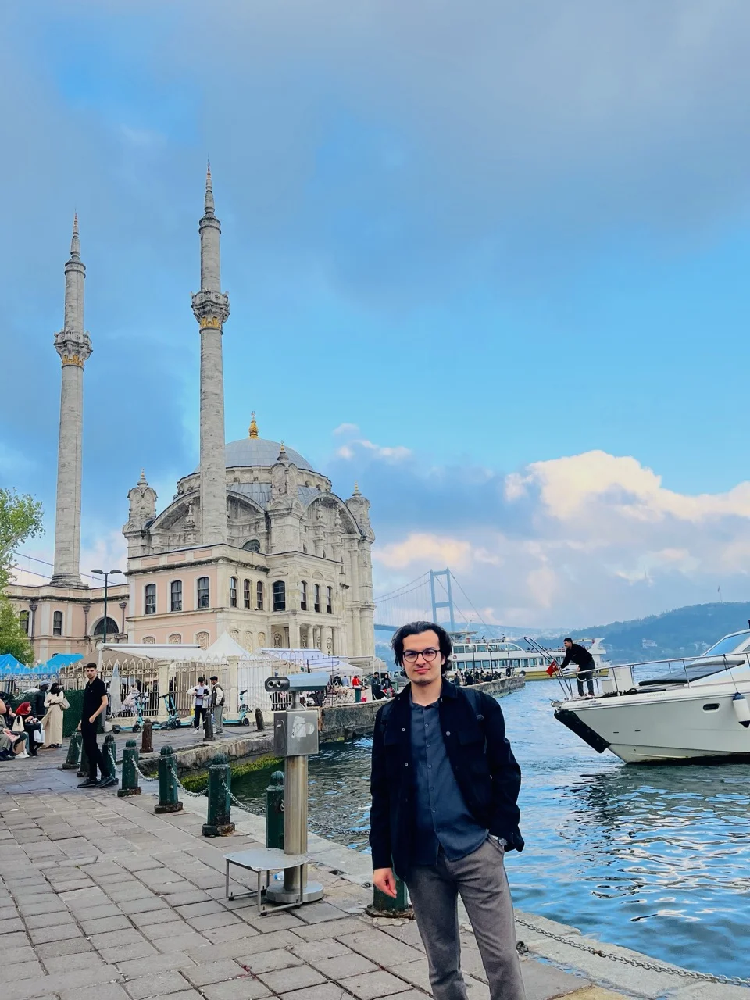

# Portfolio Performans Optimizasyon Planı

**Hedef:** Lighthouse Performance skoru 95+  
**Mevcut durum:** 57–70/100 (bölgeye göre)  
**Teşhis tarihi:** 2026-04-21

---

## Mevcut Durum Analizi

| Metrik | Mevcut | Hedef |
|--------|--------|-------|
| Performance | 57–70 | 95+ |
| FCP | 2.6–3.6s | <1.8s |
| LCP | 5.2–5.6s | <2.5s |
| TBT | 0ms ✅ | 0ms |
| CLS | 0–0.30 | 0 |
| Accessibility | 100 ✅ | 100 |
| Best Practices | 100 ✅ | 100 |
| SEO | 91 | 95+ |

**Kök nedenler:**
- 136 görsel dosya, büyük kısmı ham PNG (en büyüğü 4.2MB)
- 264KB ham CSS (minify edilmemiş, kullanılmayan kurallar dolu)
- Render-blocking: 2 ayrı Google Fonts isteği + CSS `<head>`'de senkron
- LCP görseline preload yok
- `` etiketlerinde `width`/`height` eksik → CLS 0.30
- Cache policy yok

---

## Öncelik Sırası

### 1. Görsel Optimizasyonu — *En yüksek etki (LCP 5.5s → ~2s)*

**Sorun:** PNG dosyaları 1–4MB, JPG'ler de sıkıştırılmamış. Toplam transfer 1.82MB sadece 1 sayfa için.

**Yapılacaklar:**
- [ ] Tüm PNG/JPG görselleri WebP formatına dönüştür (`cwebp` veya `squoosh`)
- [ ] Hero/profil görseli (LCP elementi) için 800px genişlik yeterli — büyük olanları yeniden boyutlandır
- [ ] Animasyonlu GIF varsa WebM/MP4'e dönüştür
- [ ] `.heic` uzantılı `helloi.heic` dosyasını WebP/AVIF'e çevir

**Komutlar (terminal):**
```bash
# brew install webp  (bir kez yükle)
cd ~/Desktop/web
for f in *.png *.jpg *.jpeg; do
  cwebp -q 80 "$f" -o "${f%.*}.webp"
done
```

**HTML'de değişiklik:** Her `` → ``  
Geriye dönük uyumluluk için `<picture>` kullanılabilir ama modern tarayıcılar için WebP direkt yeterli.

---

### 2. LCP Görselini Preload Et — *+8–12 puan (kolay, hızlı)*

**Sorun:** Sayfanın LCP elementi (büyük olasılıkla profil fotoğrafı veya hero banner) HTML parser'ın bulmasını bekliyor.

**Yapılacaklar:**
- [ ] Her sayfanın `<head>`'ine LCP görselini `preload` ekle
- [ ] LCP görselinde `loading="eager"` + `fetchpriority="high"` ekle
- [ ] Diğer görsellere `loading="lazy"` ekle

```html
<!-- <head> içine ekle, CSS linklerinden ÖNCE -->
<link rel="preload" as="image" href="imerhaba.webp" fetchpriority="high">

<!-- Hero/profil img etiketinde -->


<!-- Diğer tüm görsellerde -->

```

---

### 3. Render-Blocking Kaynakları Gider — *FCP 3.5s → ~1.5s*

**Sorun:** CSS ve Google Fonts `<head>`'de senkron yükleniyor, tarayıcı render'ı bekliyor.

#### 3a. Google Fonts Optimizasyonu

**Mevcut (kötü):**
```html
<link rel="preconnect" href="https://fonts.googleapis.com">
<link rel="preconnect" href="https://fonts.gstatic.com" crossorigin>
<link href="https://fonts.googleapis.com/css2?family=Inter:ital,opsz,wght@...&display=swap" rel="stylesheet">
<link rel="preconnect" href="https://fonts.gstatic.com" crossorigin>  <!-- DUPLICATE -->
<link href="https://fonts.googleapis.com/css2?family=Pacifico&display=swap" rel="stylesheet">
```

**Düzeltilmiş (iyi):**
```html
<link rel="preconnect" href="https://fonts.googleapis.com">
<link rel="preconnect" href="https://fonts.gstatic.com" crossorigin>
<!-- İki fontu TEK istekte birleştir -->
<link rel="preload" as="style" href="https://fonts.googleapis.com/css2?family=Inter:wght@400;500;700&family=Pacifico&display=swap">
<link rel="stylesheet" href="https://fonts.googleapis.com/css2?family=Inter:wght@400;500;700&family=Pacifico&display=swap" media="print" onload="this.media='all'">
<noscript><link rel="stylesheet" href="https://fonts.googleapis.com/css2?family=Inter:wght@400;500;700&family=Pacifico&display=swap"></noscript>
```

- [ ] Tüm 28 HTML dosyasında duplicate `preconnect` kaldır
- [ ] İki font isteğini tek URL'de birleştir
- [ ] `media="print" onload` trick ile non-blocking yükle

#### 3b. Critical CSS Inline Et

- [ ] Her sayfanın "above-the-fold" (ilk ekran) CSS'ini `<style>` tag içine inline et
- [ ] Geri kalan CSS'i `<link rel="preload">` + `onload` ile async yükle

```html
<head>
  <style>
    /* SADECE ilk ekranda görünen elementlerin CSS'i — navbar, hero section */
    .navbar { ... }
    .profile-section { ... }
  </style>
  <link rel="preload" as="style" href="index.css" onload="this.rel='stylesheet'">
  <noscript><link rel="stylesheet" href="index.css"></noscript>
</head>
```

---

### 4. CSS Minify ve Unused CSS Temizle — *~100KB tasarruf*

**Sorun:** 7 CSS dosyası toplamda 264KB ham. Minify + unused kaldırınca ~60–80KB'a düşmeli.

**Yapılacaklar:**
- [ ] CSS dosyalarını minify et
- [ ] Her sayfada kullanılmayan CSS kurallarını tespit et (Chrome DevTools → Coverage sekmesi)
- [ ] Tekrar eden `body`, `*`, `:root` kuralları birden fazla CSS'te varsa konsolide et

**Hızlı minify (terminal):**
```bash
# npm install -g clean-css-cli
cleancss -o index.min.css index.css
cleancss -o about.min.css about.css
# ... diğerleri
```

Sonra HTML'lerde `index.css` → `index.min.css`

---

### 5. `` Etiketlerine Boyut Ekle — *CLS 0.30 → 0*

**Sorun:** Görsellerin `width` ve `height` attribute'u yok, tarayıcı yer ayıramıyor → CLS.

**Yapılacaklar:**
- [ ] Tüm `` etiketlerine gerçek boyutlarla `width` ve `height` ekle
- [ ] CSS'te `img { height: auto; }` olduğundan `width` attribute'u tek başına yeterli

```html
<!-- Öncesi -->


<!-- Sonrası -->

```

---

### 6. `font-display: swap` Ekle — *FOUT yerine anlık metin*

- [ ] Kendi CSS dosyalarında `@font-face` varsa `font-display: swap` ekle
- [ ] Google Fonts URL'inde zaten `&display=swap` var, adım 3'te zaten halloluyor

---

### 7. Cache Policy — *Tekrar ziyaretlerde hız*

**Sorun:** Sunucu cache header'ı göndermiyor.

Hosting platformuna göre:

**Netlify (`_headers` dosyası oluştur):**
```
/*
  Cache-Control: public, max-age=31536000, immutable

/*.html
  Cache-Control: public, max-age=0, must-revalidate
```

**GitHub Pages:** `.htaccess` desteklemiyor; Cloudflare CDN ekleyerek cache rule yazılabilir.

---

### 8. SEO Skoru 91 → 95+ (Bonus)

- [ ] Tüm sayfalarda `<meta name="description">` var mı kontrol et
- [ ] `<title>` etiketlerini anlamlı yap (sadece "Ana Sayfa" değil)
- [ ] `robots.txt` ve `sitemap.xml` ekle

---

## Uygulama Sırası

```
Adım 1 → Görselleri WebP'ye çevir + boyutlandır         (1–2 saat, ~20 puan kazanç)
Adım 2 → LCP preload + fetchpriority + lazy loading      (30 dk, ~8 puan)
Adım 3 → Google Fonts tek istek + non-blocking           (20 dk, ~5 puan)
Adım 4 → CSS minify                                      (15 dk, ~3 puan)
Adım 5 → img width/height ekle                           (30 dk, CLS fix)
Adım 6 → Cache headers                                   (10 dk, tekrar ziyaret)
Adım 7 → SEO meta tagları                               (20 dk)
```

**Tahmini sonuç:** Adım 1–3 tamamlanınca 90+ beklenebilir. Adım 1–5 ile 95+ ulaşılabilir.

---

## Notlar

- `fonts` klasörü var → yerel font kullanımı mümkün, Google Fonts bağımlılığı kesilebilir (en iyi seçenek)
- `gradient/` ve `tv101/` alt klasörlerinin içeriği de kontrol edilmeli
- `.heic` format web'de desteklenmiyor, dönüştürülmeli
- `instagram_icon.png` 620KB — SVG kullanılmalı (SVG zaten var: `instagram.svg`)
